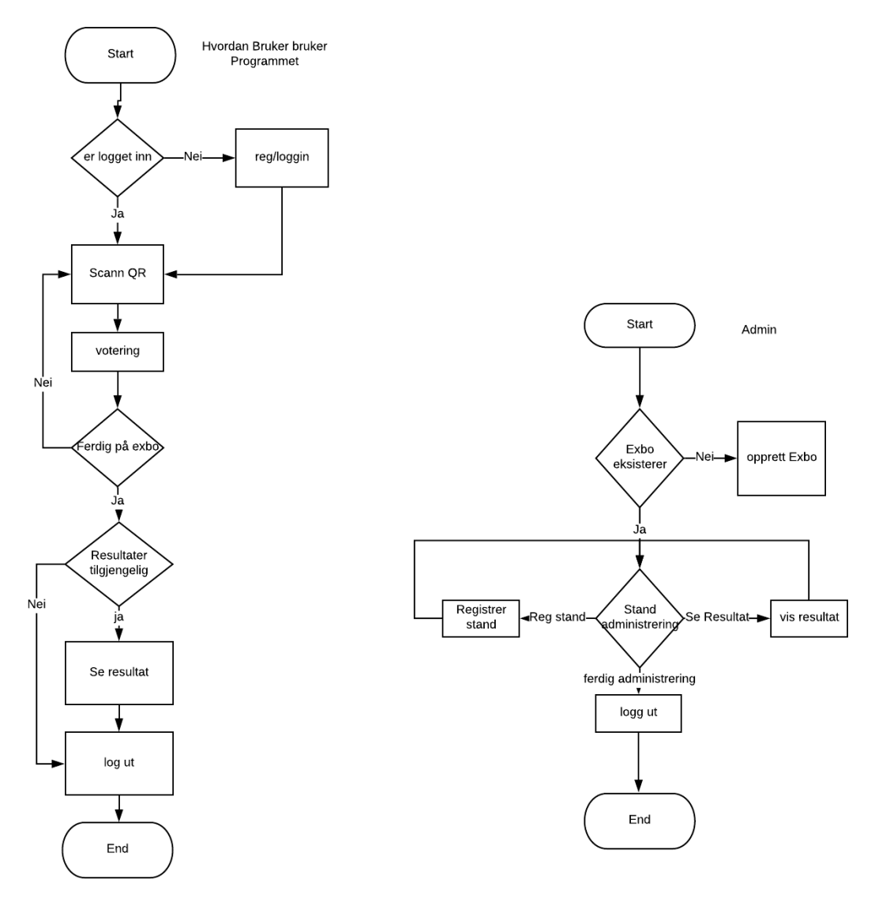
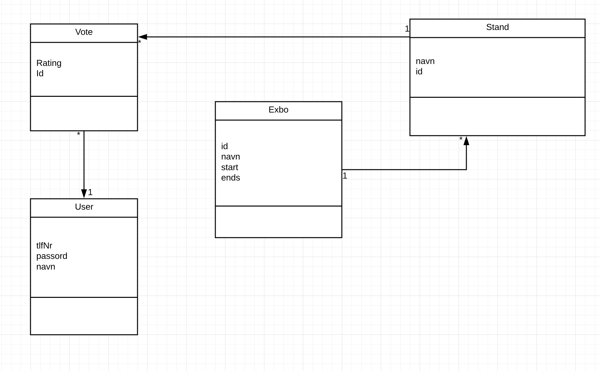
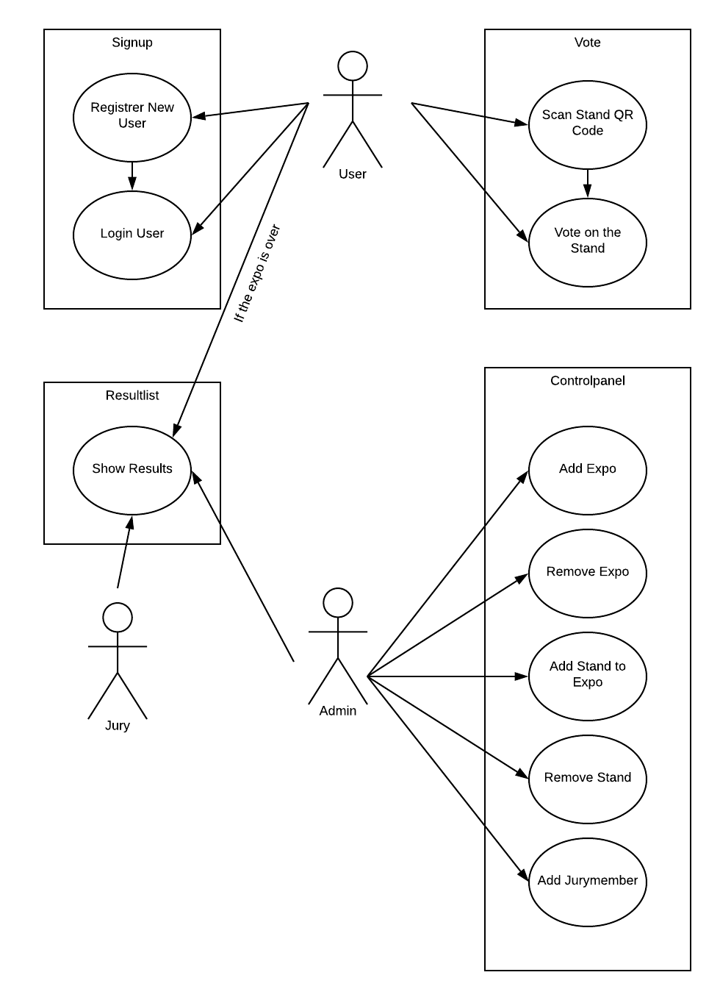
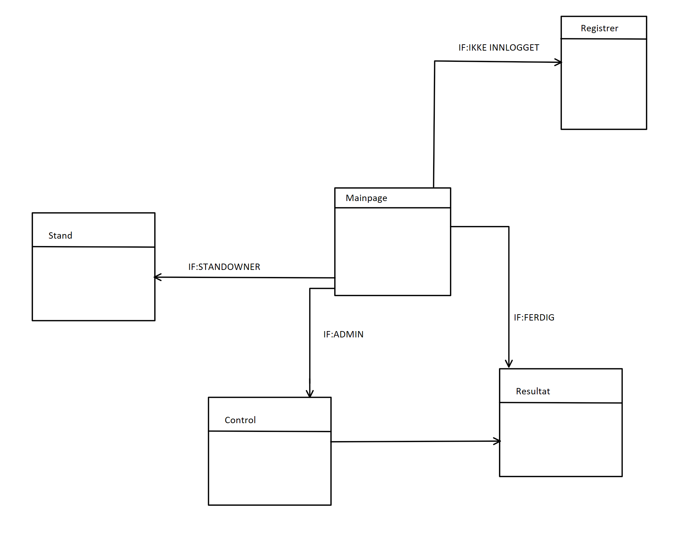
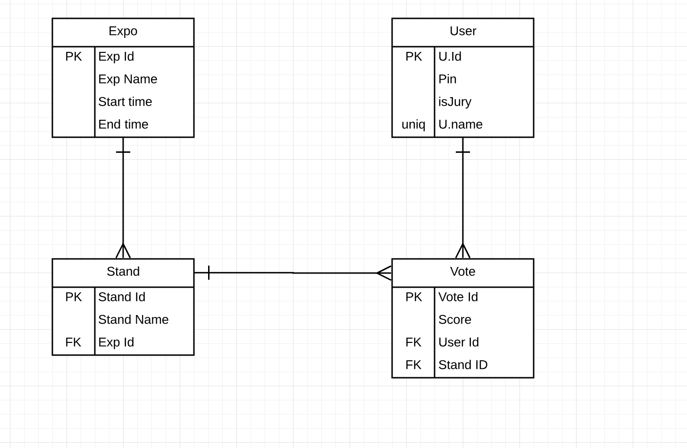

# Overordnet plan
###1. Iterasjon
- [x] Visjon.
- [x] Funksjoneller krav og ikke-funksjonelle krav.
- [x] Domenemodell.
- [x] Risikovurdering.
- [x] Flowchart/Sekvensdiagram.
- [x] Tidsestimat.
- [x] Lisens.
- [x] QR-kode scanner demo.
- [x] Arkitektdokument.
- [ ] Detaljert plan for kommende aktiviteter.
- [ ] Overordnet plan.

###2. Iterasjon
- [x] Kode.
- [ ] Få alle funksjoner til å fungere.
- [ ] Få database opp å gå.
- [x] Få Servlets opp å gå.
- [ ] 

###3. Iterasjon
- [ ] Kode.
- [x] Dummy innlogging, og registrering
- [x] Få databasen til å fungere

###4. Iterasjon 25.mars 
- [ ] Style backupløsning til scanning
- [ ] Landskode drop down på login telefonummer
- [ ] Måte å få ut QR koder på standservlet, oversikt over alle stands der
- [ ] Fikse slik at kun autoriserte brukere kan få tilgang til servlets
- [ ] Fikse login og signup siden de ikke flyter som de skal
- [ ] Deploy the application på data1
- [ ] Sjekke at det virker på mobil
- [ ] Kontrollpanel servlet og jsp 
- [ ] Resultatside servlet og jsp
- [ ] Fikse opp i all styling og stylesheet linking
- [ ] JAVADOC på alt som er nødvendig
- [ ] Tester på alt som skal ha det
- [ ] Gå igjennom intellij sin analyse av kode når vi er ferdig
- [ ] Oppdatere copyright
- [ ] Kode.
- [ ] Presentere en beta.
- [ ] Bugfixing.

###5. Iterasjon
- [ ] Lage app
- [ ] Bugfixing.
- [ ] Ferdigstilling.